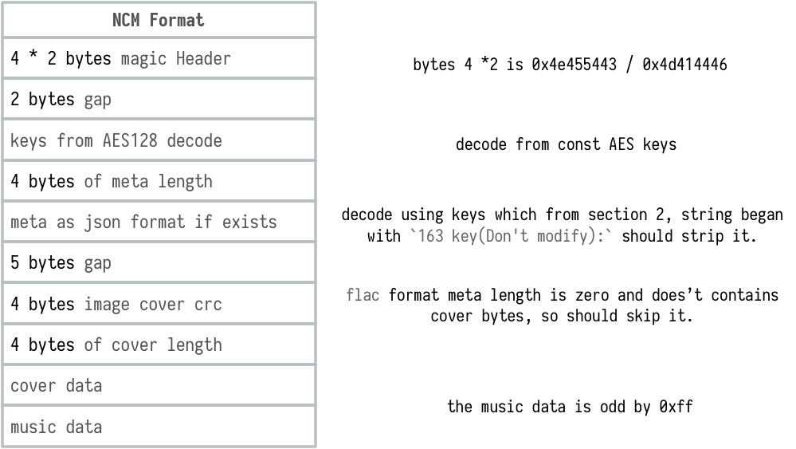

# audio convert     

## ncm格式转换  
### GitHub项目
果然有先驱者，貌似是anonymous5l提供了最初的ncmdump版本，然后再由其他几位大佬进行重构和功能完善
1. [anonymous5l](https://github.com/anonymous5l/ncmdump)（C++，MIT协议）  
   + 基于openssl库编写  
   + 2021年10月6日，原作者已经删库  
2. **[taurusxin](https://github.com/taurusxin/)**
    + [ncmdump](https://github.com/taurusxin/ncmdump)  
      + 源码复刻自 [anonymous5l/ncmdump](https://github.com/anonymous5l/ncmdump)  
      + 此版本做了全操作系统下的的跨平台编译移植，修复了一些内存溢出的问题    
    + [ncmdump-go](https://git.taurusxin.com/taurusxin/ncmdump-go)  
      + 基于[ncmdump](https://github.com/taurusxin/ncmdump) 的 Golang 移植版  
      + 从3.x 版本开始网易云音乐不再在 ncm 文件中内置封面图片，本工具支持从网易服务器上自动下载对应歌曲的封面图并写入到最终的音乐文件中
    + [ncmdump-gui](https://git.taurusxin.com/taurusxin/ncmdump-gui)  
      + ncmdump-gui 基于 ncmdump-go 开发，是一个图形化的 ncmdump 工具  
3. [nondanee](https://github.com/nondanee/ncmdump)（python，MIT协议）  
   + 依赖pycryptodome库、mutagen库，比较完善了  
   + 已删库  
4. [lianglixin](https://github.com/lianglixin/ncmdump)（python，MIT协议）  
   + fork的nondanee作者的源码，修改了依赖库依赖pycrypto库，会有一些安装和使用问题  
   + 已删库  
5. [yoki123](https://github.com/yoki123/ncmdump)（go,MIT协议）  
   + 依据anonymous51的工作，使用go语言实现  
   + 已删库  
6. [kilosonc](https://github.com/kilosonc/NCMconverter)  
   + 实现参考了[yoki123/ncmdump](https://github.com/yoki123/ncmdump)，重构了代码，并且添加了多线程支持  
7. **[lissettecarlr](https://github.com/lissettecarlr/ncmdump)**  
   + 使用python实现，提供windows客户端和WEB两种使用方式  

### 格式分析        
#### 总体结构
       
NCM 实际上不是音频格式是容器格式，封装了对应格式的 Meta 以及封面等信息
#### 密钥问题  

+ NCM使用了NCM使用了AES加密，但每个NCM加密的密钥是一样的，因此只要获取了AES的密钥KEY，就可以根据格式解开对应的资源。
+ AES是一种迭代型分组加密算法，分组长度为128bit，密钥长度为128、192或256bit，不同的密钥长度对应的迭代轮数不同，对应关系如下：

|密钥长度|轮数|
|---|---|
|128|10|
|192|12|
|256|14|

+ AES密钥推测是[annoymous51](https://github.com/anonymous5l)通过反编译播放器客户端得到的  
  1. 播放器也需要读取ncm格式，客户端就包含有解密逻辑
  2. 解密算法是AES，是对称加密
  3. 恰巧所有的文件都使用了相同的AES key，那么key在客户端播放器中就是一个常量